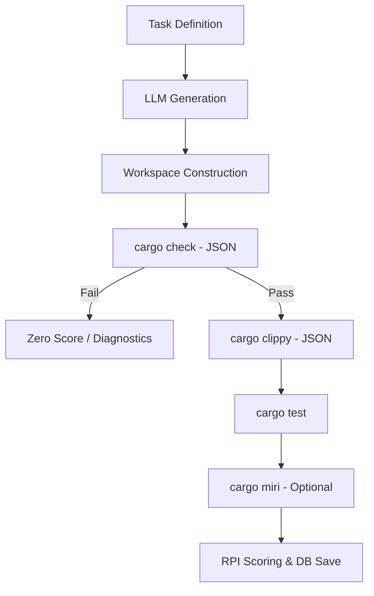

# GEMINI.md - Project Context: RustBench-Eval

## Project Overview
`rustbench-eval` is a high-precision Rust-based evaluation harness for benchmarking LLM code generation. Unlike generic benchmarks, it evaluates the "Rustiness" of code through multi-dimensional scoring (RPI) and uses the actual Rust toolchain (Cargo, Clippy, Miri) for verification.

### Core Stack
- **Language:** Rust 2021
- **Inference:** LM Studio (OpenAI-compatible) via `reqwest` + `InferenceProvider` trait.
- **Verification:** `cargo check`, `cargo clippy`, `cargo test`, `cargo miri`.
- **Database:** SQLite (WAL mode) via `sqlx`.

---

## Evaluation Pipeline



### 1. Workspace Isolation
For every task, the evaluator creates a unique `TempDir` containing:
- `Cargo.toml`: Dynamically injected dependencies from the task definition.
- `src/lib.rs`: Assembled from `context_code` + `generated_code` + `tests`.

### 2. Diagnostic Analysis
The harness uses `--message-format=json` to parse compiler errors. It categorizes them into `Syntax`, `BorrowChecker`, `TypeMismatch`, `Lifetime`, and `UnresolvedImport`. This "Distance to Compilation" metric helps track model improvement even when code doesn't build.

---

## Scoring System: Rust Proficiency Index (RPI)

The RPI is a weighted composite score (0.0 to 1.0). If code fails to compile, RPI is **0.0**.

| Component | Weight | Logic |
| :--- | :---: | :--- |
| **Functional Correctness (FC)** | 40% | `tests_passed / tests_total` |
| **Memory Safety (MSS)** | 35% | 1.0 (Miri clean), 0.7 (Unsafe but no Miri), 0.5 (Miri fail + tests pass), 0.0 (fail) |
| **Idiomatic Quality (IQ)** | 25% | `1.0 - (weighted_clippy_errors / (LOC * 10))` |

*Note: Clippy Error weight = 20, Warning weight = 5.*

---

## Usage Guide

### Common CLI Tasks
- **Standard Evaluation:**
  ```bash
  rustbench run --tasks tasks/rustbench_tasks.jsonl --output results.jsonl
  ```
- **Safety-Critical (Miri) Evaluation:**
  ```bash
  rustbench run --tasks tasks/rustbench_tasks.jsonl --miri --timeout 60
  ```
- **Interactive Single Task:**
  ```bash
  rustbench single --task '{"task_id":"...","prompt":"..."}' --model "gpt-4"
  ```

### Database Management
Results are stored in `~/.rustbench/results.db`.
- `runs`: Metadata about the model and generation config.
- `evaluations`: Granular results per task, including full generated code and diagnostic logs.

---

## Technical Considerations
- **Non-Interactive Execution:** The harness uses `--test-threads=1` and timeouts (default 30s) to prevent deadlocks from LLM-generated code.
- **Code Extraction:** `extract_code` logic automatically strips Markdown backticks (```rust) from LLM responses.
- **Provider Abstraction:** The `InferenceProvider` trait allows adding support for Ollama, Anthropic, or OpenAI with minimal changes to `lm_studio.rs`.

## Task Format (JSONL)
```json
{
  "task_id": "unique_id",
  "tier": "algorithmic_core | idiomatic_systems | safety_critical | repository_architecture",
  "prompt": "Instruction text",
  "signature": "pub fn ...",
  "dependencies": { "serde": "1.0" },
  "tests": "#[test] ...",
  "miri_compatible": true
}
```